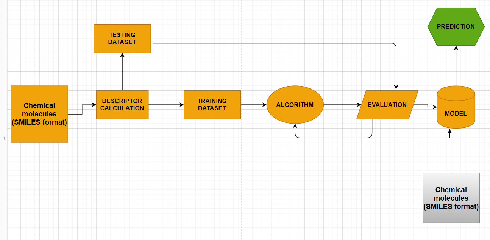

# <u>**BB-PRED**: Machine learning based drug permeablity prediction across Blood-Brain barrier in CNS.</u>

## What is **blood brain barrier**?
 
The blood–brain barrier (BBB) is a highly selective semipermeable border of endothelial cells that prevents solutes in the circulating blood from non-selectively crossing into the extracellular fluid of the central nervous system where neurons reside.
 

 
 
 

## What obstacles faced during **drug discovery**?
 
Drug design and discovery is a very expensive process, with numerous new compounds being developed at a rapid rate. Only around 2% of known drugs can pass through the BBB, this presents a problem in the Central Nervous System (CNS) drug development.
 
 

## **<U>AIM OF THE PROJECT:</U>**
This project aims to develop a solution that can predict, with confidence, the probability of a drug passing through the BBB in the hope that this can speed up the process of developing a CNS drug.
 

## <u>**Workflow of the Project**</u>
 

 
 
 

## <u>**TEST RESULT OF BEST MODEL**</u>

 
 

**This project is still active more work in being going this project, addtional propertie of drug and protein on the membrane is also considered in future update.**

 

## <u>Refrences</u>:
+ Martins e.tal 
+ Gupta etal
+ William A Banks[doi:10.1186/1471-2377-9-S1-S3]